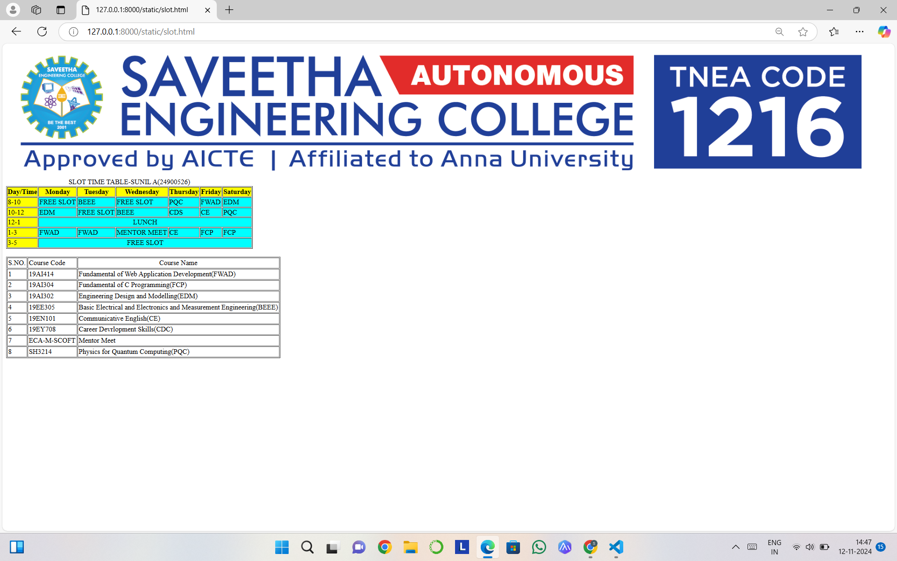

# Ex03 Time Table
## Date:12-11-2024

## AIM
To write a html webpage page to display your slot timetable.

## ALGORITHM
### STEP 1
Create a Django-admin Interface.

### STEP 2
Create a static folder and inert HTML code.

### STEP 3
Create a simple table using ```<table>``` tag in html.

### STEP 4
Add header row using ```<th>``` tag.

### STEP 5
Add your timetable using ```<td>``` tag.

### STEP 6
Execute the program using runserver command.

## PROGRAM
```
<html>
    <body>
        </src>
        <table border="1">
            <caption>SLOT TIME TABLE-SUNIL.A(24900526)</caption>
            <tr bgcolor="yellow">
             <th>Day/Time</th>
             <th>Monday</th>
             <th>Tuesday</th>
             <th>Wednesday</th>
             <th>Thursday</th>
             <th>Friday</th>
             <th>Saturday</th>
            </tr>
            <tr>
                <td bgcolor="yellow">8-10</td>
                <td bgcolor="cyan">FREE SLOT</td>
                <td bgcolor="cyan">BEEE</td>
                <td bgcolor="cyan">FREE SLOT</td>
                <td bgcolor="cyan">PQC</td>
                <td bgcolor="cyan">FWAD</td>
                <td bgcolor="cyan">EDM</td>
            </tr>
             <tr>
                 <td bgcolor="yellow">10-12</td>
                 <td bgcolor="cyan">EDM</td>
                 <td bgcolor="cyan">FREE SLOT</td>
                 <td bgcolor="cyan">BEEE</td>
                 <td bgcolor="cyan">CDS</td>
                 <td bgcolor="cyan">CE</td>
                 <td bgcolor="cyan">PQC</td>
             </tr>
             <tr>
                <td bgcolor="yellow">12-1</td>
                <td bgcolor="cyan " colspan="6" align="center">LUNCH</td>
               
             </tr>
             <tr>
             <td bgcolor="yellow">1-3</td>
             <td bgcolor="cyan">FWAD</td>
             <td bgcolor="cyan">FWAD</td>
             <td bgcolor="cyan">MENTOR MEET</td>
             <td bgcolor="cyan">CE</td>
             <td bgcolor="cyan">FCP</td>
             <td bgcolor="cyan">FCP</td>
             </tr>
             <tr>
                <td bgcolor="yellow">3-5</td>
                <td bgcolor="cyan"colspan=6 align="center">FREE SLOT</td>
             </tr>

        </table>
            <br>
        <table border="1" cellpadding="2">
            <tr>
                <td>S.NO.</td>
                <td>Course Code</td>
                <td align="center">Course Name </td>
            </tr>
            <tr>
                <td>1</td>
                <td>19AI414</td>
                <td>Fundamental of Web Application Development(FWAD)</td>
            </tr>
            <tr>
                <td>2</td>
                <td>19AI304</td>
                <td>Fundamental of C Programming(FCP)</td>
            </tr>
            <tr>
                <td>3</td>
                <td>19AI302</td>
                <td>Engineering Design and Modelling(EDM)</td>
            </tr>
            <tr>
                <td>4</td>
                <td>19EE305</td>
                <td>Basic Electrical and Electronics and Measurement Engineering(BEEE)</td>
            </tr>
            <tr>
                <td>5</td>
                <td>19EN101</td>
                <td>Communicative English(CE)</td>
            </tr>
            <tr>
                <td>6</td>
                <td>19EY708</td>
                <td>Career Devrlopment Skills(CDC)</td>
            </tr>
            <tr>
                <td>7</td>
                <td>ECA-M-SCOFT</td>
                <td>Mentor Meet</td>
            </tr>
            <tr>
                <td>8</td>
                <td>SH3214</td>
                <td>Physics for Quantum Computing(PQC)</td>
            </tr>
            
           
        </table>
    </body>
</html>
```

## OUTPUT


## RESULT
The program for creating slot timetable using basic HTML tags is executed successfully.
